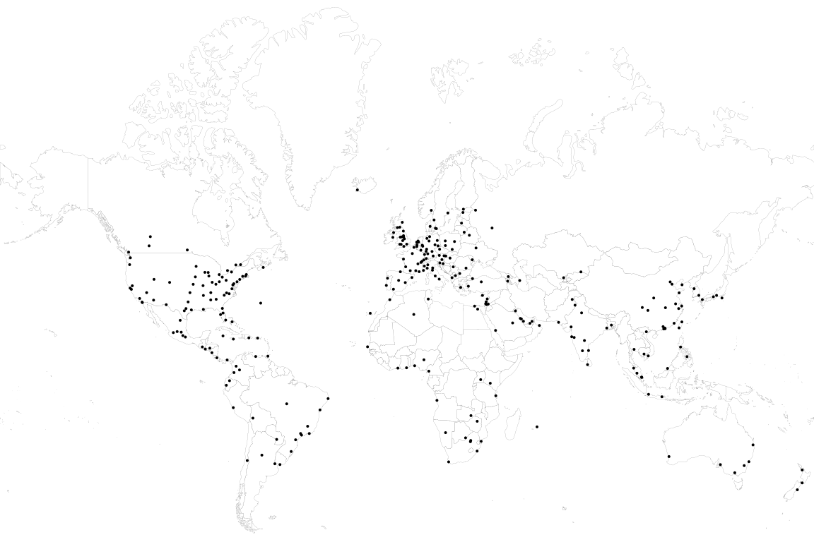

# Cities

## Global Cities (GaWC)

## Football World Cup finals

Locations of FIFA World Cup finals, 1930-2018.

| Name           | Iso   | Latitude    | Longitude    | Year  |
| -------------- | ----- | ----------- | ------------ | ----- |
| Montevideo     | URY   | -34.9059039 | -56.1913569  | 1930  |
| Rome           | ITA   | 41.8933439  | 12.4830718   | 1934  |
| Paris          | FRA   | 48.8565056  | 2.3521334    | 1938  |
| Rio de Janeiro | BRA   | -22.9110137 | -43.2093727  | 1950  |
| Bern           | CHE   | 46.9482713  | 7.4514512    | 1954  |
| Stockholm      | SWE   | 59.3251172  | 18.0710935   | 1958  |
| Santiago       | CHL   | -33.4377968 | -70.6504451  | 1962  |
| London         | GBR   | 51.5073219  | -0.1276473   | 1966  |
| Mexico City    | MEX   | 19.4325301  | -99.1332102  | 1970  |
| Munich         | DEU   | 48.1371079  | 11.5753822   | 1974  |
| Buenos Aires   | ARG   | -34.612869  | -58.4459789  | 1978  |
| Madrid         | ESP   | 40.4167047  | -3.7035825   | 1982  |
| Mexico City    | MEX   | 19.4325301  | -99.1332102  | 1986  |
| Rome           | ITA   | 41.8933439  | 12.4830718   | 1990  |
| Los Angeles    | USA   | 34.053717   | -118.2427265 | 1994  |
| Paris          | FRA   | 48.8565056  | 2.3521334    | 1998  |
| Yokohama       | URY   | -34.9059039 | -56.1913569  | 2002  |
| Berlin         | DEU   | 52.5170365  | 13.3888599   | 2006  |
| Johannesburg   | ZAF   | -26.205     | 28.0497222   | 2010  |
| Rio de Janeiro | BRA   | -22.9110137 | -43.2093727  | 2014  |
| Moscow         | RUS   | 55.7516335  | 37.6187042   | 2018  |